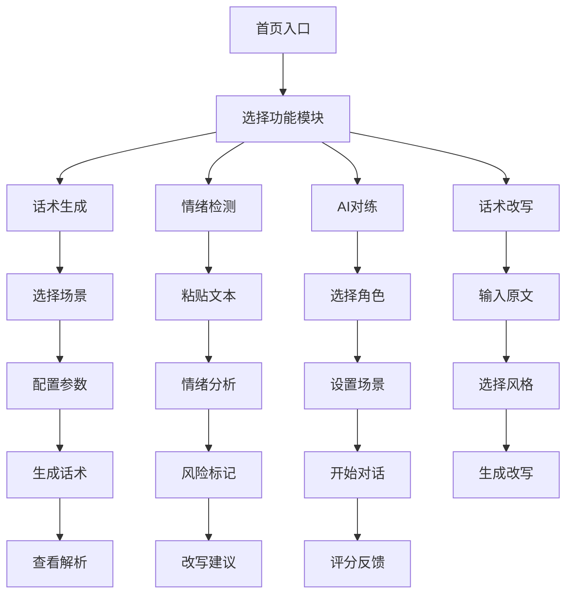

# 职场"嘴替"助手 - 产品需求文档 (PRD)

## 1. 产品概述

职场"嘴替"助手是一款面向职场人士的 AI 沟通辅助工具，集成了**话术生成、情绪检测、AI 对练**三大核心功能。帮助用户解决职场沟通难题，避免"发完就后悔"的尴尬，提升职场表达能力和情商。

**目标用户**：职场新人、社恐人士、需要频繁沟通的产品/运营/销售、想加薪/提需求的打工人

---

## 2. 核心功能

### 2.1 功能模块

| 模块名称 | 功能描述 |
|---------|---------|
| 场景话术生成 | 预设高频职场场景，一键生成多版本话术 |
| 情绪红绿灯检测 | 分析文本情绪风险，标注问题词汇 |
| AI 对练模拟器 | AI 扮演职场角色进行实时对话练习 |
| 话术改写优化 | 将大白话转化为专业职场表达 |

### 2.2 页面详情

| 页面名称 | 模块名称 | 功能描述 |
|---------|---------|---------|
| 首页 | Hero 区域 | 产品介绍、核心功能入口、快速开始按钮 |
| 首页 | 功能导航 | 四大功能模块卡片式展示 |
| 话术生成页 | 场景选择器 | 预设场景列表（加薪、拒绝、汇报等） |
| 话术生成页 | 参数配置 | 对方身份、我的立场、具体情况输入 |
| 话术生成页 | 结果展示 | 三套话术（温和/强硬/高情商）+ 逻辑解析 |
| 情绪检测页 | 文本输入区 | 粘贴待检测文本 |
| 情绪检测页 | 红绿灯标记 | 红/黄/绿三色情绪标记 |
| 情绪检测页 | 风险词识别 | 高亮甩锅词、对抗词、情绪化词 |
| 情绪检测页 | 改写建议 | 三种风格改写版本 |
| AI 对练页 | 角色选择 | 选择 AI 扮演的角色（老板/HR/客户） |
| AI 对练页 | 场景设置 | 设置对话场景和背景 |
| AI 对练页 | 对话界面 | 实时对话交互区 |
| AI 对练页 | 评分反馈 | 对话结束后的打分和优化建议 |
| 话术改写页 | 输入区 | 输入原始表达 |
| 话术改写页 | 风格选择 | 选择改写风格 |
| 话术改写页 | 结果对比 | 原文与改写对比展示 |

---

## 3. 核心流程

### 3.1 话术生成流程

用户选择场景 → 配置参数（对方身份、立场、情况）→ AI 生成三套话术 → 用户查看逻辑解析 → 复制使用

### 3.2 情绪检测流程

用户粘贴文本 → AI 分析情绪风险 → 红绿灯标记 + 风险词高亮 → 提供改写建议 → 用户选择采纳

### 3.3 AI 对练流程

用户选择角色和场景 → AI 发起对话 → 用户回复 → AI 继续施压/追问 → 对话结束 → AI 打分 + 逐句优化建议

### 3.4 流程图

---

## 4. 用户界面设计

### 4.1 设计风格

- **主色调**：深蓝紫渐变（专业感 + 科技感）+ 橙色点缀（活力、行动力）
- **辅助色**：红/黄/绿三色用于情绪标记
- **按钮风格**：圆角胶囊按钮，带微阴影和 hover 动效
- **字体**：思源黑体 / Noto Sans SC（中文），Poppins（英文标题）
- **布局风格**：卡片式布局，左侧导航，右侧内容区
- **图标风格**：线性图标（Lucide），统一 2px 描边

### 4.2 页面设计概述

| 页面名称 | 模块名称 | UI 元素 |
|---------|---------|---------|
| 首页 | Hero 区域 | 渐变背景、大标题、副标题、CTA按钮、动态粒子效果 |
| 首页 | 功能导航 | 4个功能卡片，hover 放大效果，图标+标题+描述 |
| 话术生成页 | 场景选择器 | 标签云形式，选中高亮，可滚动 |
| 话术生成页 | 结果展示 | 三列卡片布局，不同颜色边框区分风格 |
| 情绪检测页 | 红绿灯标记 | 圆形指示灯动画，风险词下划线高亮 |
| AI 对练页 | 对话界面 | 聊天气泡样式，AI 消息左对齐，用户消息右对齐 |
| AI 对练页 | 评分反馈 | 环形进度条显示分数，列表展示优化建议 |

### 4.3 响应式设计

- **桌面优先**：主要针对桌面端设计，保证演示效果
- **移动端适配**：卡片堆叠、导航折叠、触控优化

---

## 5. 预设场景库

### 5.1 高频职场场景

| 场景类别 | 具体场景 |
|---------|---------|
| 薪酬沟通 | 加薪申请、年终奖谈判、薪资期望回复 |
| 任务管理 | 拒绝加班、拒绝不合理任务、催促进度 |
| 汇报沟通 | 年终汇报、项目汇报、问题上报 |
| 人际关系 | 向上提意见、跨部门协调、道歉补救 |
| 离职求职 | 离职沟通、面试回答、薪资谈判 |
| 客户沟通 | 客户投诉、需求变更、价格谈判 |

---

## 6. 情绪检测规则

### 6.1 风险词库

| 类型 | 示例词汇 |
|-----|---------|
| 甩锅词 | "这不归我"、"我不知道"、"你自己弄"、"不是我的事" |
| 对抗词 | "但是"、"明明"、"你总是"、"每次都" |
| 情绪化词 | "无语"、"服了"、"随便吧"、"呵呵" |
| 攻击性词 | "你懂什么"、"你行你上"、"别跟我讲" |

### 6.2 情绪等级

- 🔴 **红色**：攻击性强、易引发冲突、可能被记录
- 🟡 **黄色**：语气生硬、容易误解、建议优化
- 🟢 **绿色**：专业、得体、无明显问题

---

## 7. AI 对练评分维度

| 维度 | 权重 | 说明 |
|-----|-----|-----|
| 逻辑清晰度 | 25% | 表达是否有条理、有依据 |
| 语气得体度 | 25% | 是否专业、不卑不亢 |
| 立场坚定度 | 20% | 是否守住底线、不被带偏 |
| 风险规避度 | 15% | 是否踩雷、是否留下把柄 |
| 方案建设性 | 15% | 是否提供可行解决方案 |
