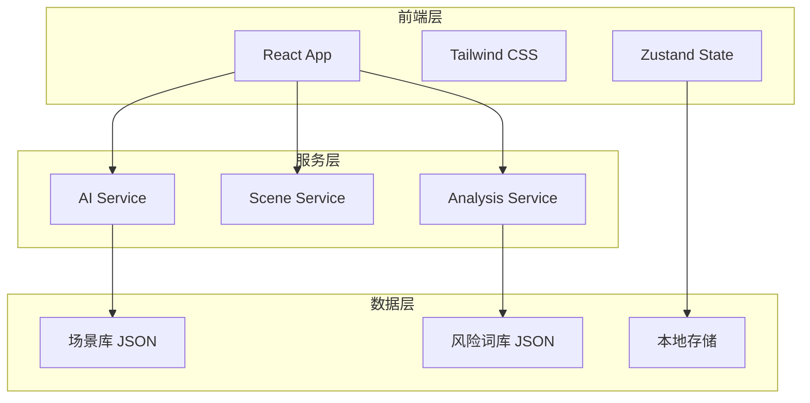
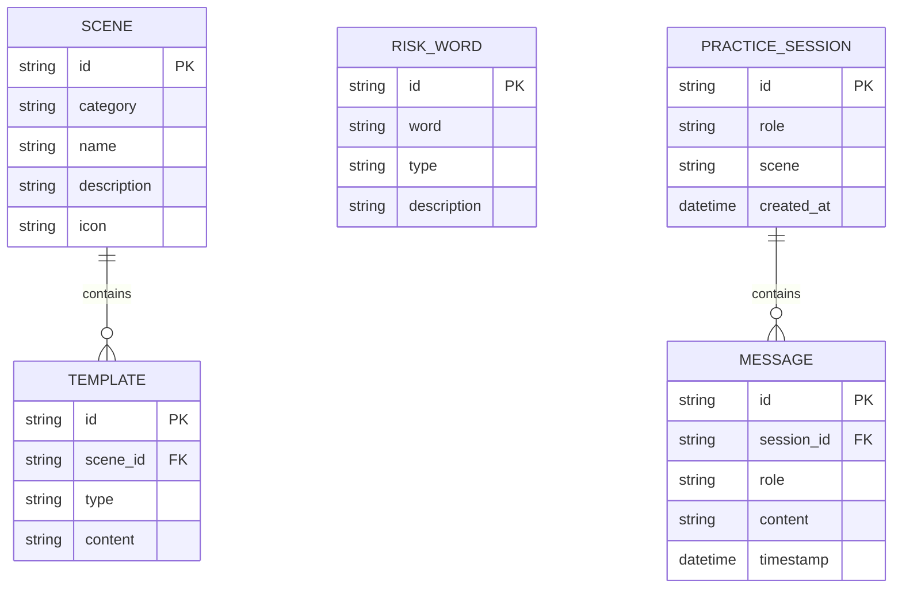

# 职场"嘴替"助手 - 技术架构文档

## 1. 架构设计



## 2. 技术栈说明

| 层级 | 技术选型 | 说明 |
|-----|---------|-----|
| 前端框架 | React 18 + TypeScript | 组件化开发，类型安全 |
| 样式方案 | Tailwind CSS 3 | 原子化 CSS，快速开发 |
| 状态管理 | Zustand | 轻量级状态管理 |
| 构建工具 | Vite | 快速热更新，优化打包 |
| AI 能力 | 模拟 AI 响应 | 本地模拟，可扩展接入真实 API |
| 数据存储 | LocalStorage + JSON | 本地持久化，无需后端 |

## 3. 路由定义

| 路由 | 页面 | 说明 |
|-----|-----|-----|
| `/` | 首页 | 产品介绍和功能入口 |
| `/generate` | 话术生成页 | 场景选择和话术生成 |
| `/detect` | 情绪检测页 | 文本情绪分析 |
| `/practice` | AI 对练页 | 实时对话练习 |
| `/rewrite` | 话术改写页 | 表达优化改写 |

## 4. 数据模型

### 4.1 场景数据模型

```typescript
interface Scene {
  id: string;
  category: string;
  name: string;
  description: string;
  icon: string;
  prompts: {
    identity: string[];
    stance: string[];
  };
  templates: {
    gentle: string;
    firm: string;
    emotional: string;
  };
}
```

### 4.2 情绪分析结果模型

```typescript
interface EmotionResult {
  level: 'red' | 'yellow' | 'green';
  score: number;
  riskWords: Array<{
    word: string;
    type: 'shift' | 'confront' | 'emotional' | 'attack';
    position: [number, number];
  }>;
  suggestions: string[];
  rewrites: {
    gentle: string;
    professional: string;
    firm: string;
  };
}
```

### 4.3 对练对话模型

```typescript
interface PracticeMessage {
  id: string;
  role: 'user' | 'ai';
  content: string;
  timestamp: number;
}

interface PracticeSession {
  id: string;
  role: 'boss' | 'hr' | 'client' | 'colleague';
  scene: string;
  messages: PracticeMessage[];
  score?: {
    logic: number;
    tone: number;
    stance: number;
    risk: number;
    solution: number;
    total: number;
  };
  feedback?: string[];
}
```

### 4.4 ER 图



## 5. 核心服务设计

### 5.1 AI 服务 (模拟)

```typescript
interface AIService {
  generateScripts(scene: string, params: ScriptParams): Promise<ScriptResult>;
  analyzeEmotion(text: string): Promise<EmotionResult>;
  practiceReply(context: PracticeContext): Promise<string>;
  evaluatePractice(session: PracticeSession): Promise<PracticeScore>;
  rewriteText(text: string, style: RewriteStyle): Promise<string>;
}
```

### 5.2 场景服务

```typescript
interface SceneService {
  getCategories(): Promise<string[]>;
  getScenesByCategory(category: string): Promise<Scene[]>;
  getSceneById(id: string): Promise<Scene>;
}
```

## 6. 项目结构

```
src/
├── components/
│   ├── common/
│   │   ├── Button.tsx
│   │   ├── Card.tsx
│   │   ├── Input.tsx
│   │   └── Tag.tsx
│   ├── layout/
│   │   ├── Header.tsx
│   │   ├── Navigation.tsx
│   │   └── Layout.tsx
│   ├── generate/
│   │   ├── SceneSelector.tsx
│   │   ├── ParamsForm.tsx
│   │   └── ScriptResult.tsx
│   ├── detect/
│   │   ├── TextInput.tsx
│   │   ├── EmotionIndicator.tsx
│   │   ├── RiskHighlight.tsx
│   │   └── RewriteSuggestion.tsx
│   ├── practice/
│   │   ├── RoleSelector.tsx
│   │   ├── ChatInterface.tsx
│   │   ├── MessageBubble.tsx
│   │   └── ScorePanel.tsx
│   └── rewrite/
│       ├── OriginalInput.tsx
│       ├── StyleSelector.tsx
│       └── CompareView.tsx
├── pages/
│   ├── Home.tsx
│   ├── Generate.tsx
│   ├── Detect.tsx
│   ├── Practice.tsx
│   └── Rewrite.tsx
├── services/
│   ├── aiService.ts
│   ├── sceneService.ts
│   └── analysisService.ts
├── data/
│   ├── scenes.json
│   └── riskWords.json
├── store/
│   ├── usePracticeStore.ts
│   └── useHistoryStore.ts
├── hooks/
│   ├── useAI.ts
│   └── useLocalStorage.ts
├── utils/
│   ├── textAnalysis.ts
│   └── formatters.ts
├── types/
│   └── index.ts
├── App.tsx
└── main.tsx
```

## 7. 关键实现说明

### 7.1 AI 模拟策略

由于是 Demo 项目，AI 能力采用本地模拟：

1. **话术生成**：基于场景模板 + 参数填充 + 随机变体
2. **情绪检测**：关键词匹配 + 规则引擎
3. **AI 对练**：预设对话树 + 随机追问
4. **话术改写**：模板替换 + 句式转换

### 7.2 扩展接口

预留真实 AI API 接口：

```typescript
interface AIProvider {
  chat(messages: Message[]): Promise<string>;
  analyze(text: string): Promise<AnalysisResult>;
}
```

可快速接入 OpenAI、Claude 等 API。

## 8. 性能优化

- 使用 React.memo 优化组件渲染
- 使用 useMemo 缓存计算结果
- 使用虚拟滚动处理长对话列表
- 图片懒加载
- 代码分割按路由加载
